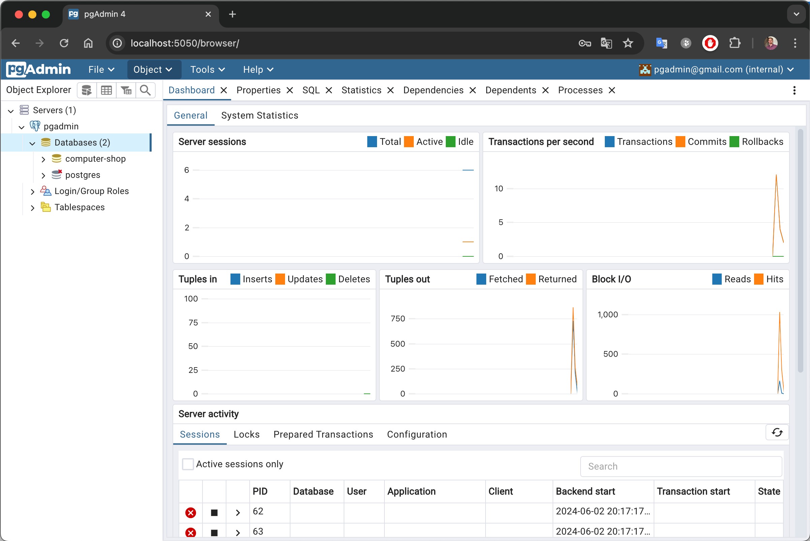

# Установка Postgres
Развернем самую популярную, на текущий момент, базу данных Postgres.
Вместо того чтобы устанавливать её напрямую на вашу операционную систему, будь то Windows или Mac, мы воспользуемся мощью Docker.

## Установка Docker Desktop
Сначала, нам нужно скачать и установить [Docker Desktop](https://www.docker.com/products/docker-desktop/)</br>
Docker - это такой инструмент контейнеризации, который развернет нам такую маленькую, облегчённую linux с установленной внутри неё базой данных Postgres.


## Развертывание Docker-контейнера Postgres
Теперь, когда Docker установлен, мы можем приступить к развертыванию нашего контейнера с Postgres.

### Создаем файл docker-compose.yml
Первым делом создадим файл [docker-compose.yml](../../docker-compose.yml) в удобной для нас директории. В этом файле мы будем определять и настраивать любые наши контейнеры

Мы определим здесь 2 докер контейнера:
   1. Контейнер с базой данных Postgres.
   2. Контейнер с pgAdmin - веб-интерфейсом для управления базой данных.

Вверху файла указываем версию docker-compose:
```yaml
version: '3.8'
```

Контейнеры должны быть описаны в блоке `services`:

**Контейнер `postgres`**

Давайте сходим на `Docker Hub` и найдем нужный нам [docker-образ](https://hub.docker.com/_/postgres)

```yaml
services:
   postgres:
      container_name: postgres_container
      image: postgres
      environment:
         POSTGRES_USER: postgres
         POSTGRES_PASSWORD: postgres
         POSTGRES_DB: computer-shop
      ports:
         - "5432:5432"
      restart: unless-stopped
```
Здесь мы определяем несколько ключевых параметров. Вот их детальное объяснение:

- `container_name` - Это имя, которое мы присваиваем нашему контейнеру. Вы можете выбрать любое имя, которое вам нравится. Это имя поможет нам легко идентифицировать контейнер при выполнении команд Docker.
- `image` - Здесь мы указываем образ Docker, который будет использоваться для создания контейнера. Этот образ содержит предустановленную операционную систему Linux и Postgres, готовую к использованию.
- `environment` - В этой секции мы устанавливаем переменные окружения, которые будут доступны внутри контейнера. Эти переменные используются для настройки базы данных.
  - `POSTGRES_USER` - имя пользователя, который будет использоваться для доступа к базе данных
  - `POSTGRES_PASSWORD` - пароль для пользователя, указанного выше
  - `POSTGRES_DB` - название базы данных
  - `ports` - Когда мы пишем `"5432:5432"`, это значит, что компьютер будет слушать порт 5432, а все, что приходит на этот порт, будет прокинуто на порт 5432 внутри контейнера postgres
- `restart` - здесь мы задаем политику перезапуска контейнера. Указание `unless-stopped`,гарантирует, что контейнер будет автоматически перезапускаться после остановки из-за ошибок или перезагрузки системы, за исключением случаев, когда он был явно остановлен пользователем вручную.

**Контейнер `pgdmin`**
Он нам нужен для того чтобы мы могли администрировать и делать запросы в нашу базу данных через удобный web интерфейс

```yaml
  pgadmin:
    container_name: pgadmin_container
    image: dpage/pgadmin4
    environment:
      PGADMIN_DEFAULT_EMAIL: pgadmin@gmail.com
      PGADMIN_DEFAULT_PASSWORD: pgadmin
    ports:
      - "5050:80"
    restart: unless-stopped
```
Здесь мы используем стандартный образ dpage/pgadmin4, настраиваем данные для входа и порты, а также политику перезапуска.

### Запуск контейнеров
Теперь, когда наш файл [docker-compose.yml](../../docker-compose.yml) готов, давайте запустим контейнеры, для этого выполним команду:
```bash
docker-compose up -d
```


Теперь давайте проверим, что все контейнеры успешно запущены:
```bash
docker-compose ps
```


тот же самый результат можем увидеть в Docker Desktop


## Проверка работы pgAdmin
Теперь когда у нас все установлено, откроем web-интерфейс нашей базы данных используя клиент pgAdmin, для этого
перейдем в браузер и в адресную строку введем хост и порт установленного нами pgAdmin. Он у нас установлен на компьютере, значит localhost, а порт, как вы помните, мы устанавливали `5050` в нашем [docker-compose.yml](../../docker-compose.yml)


Нас просят залогиниться, вводим email/password, который мы также устанавливали в нашем [docker-compose.yml](../../docker-compose.yml)


Сейчас здесь пусто, нам нужно создать сервер


на вкладке General указываем любое имя сервера, это неважно


затем на вкладке Connection указываем параметры подключения:


где, почти все значения полей мы указывали в нашем [docker-compose.yml](../../docker-compose.yml)
- `Host name/address` - это название контейнера postgres
- `Port`- это внешний порт контейнера postgres 
- `Username`- это имя пользователя
- `Password`- это пароль пользователя
- `Maintanance database` - название базы данных `computer-shop`
и нажмем Save


Видим что мы успешно подключились к нашей базе данных

Поздравляю друзья! Вы только что сделали первый шаг в разработке вашего проекта магазина компьютерной техники. Впереди нас ждет еще много интересного!